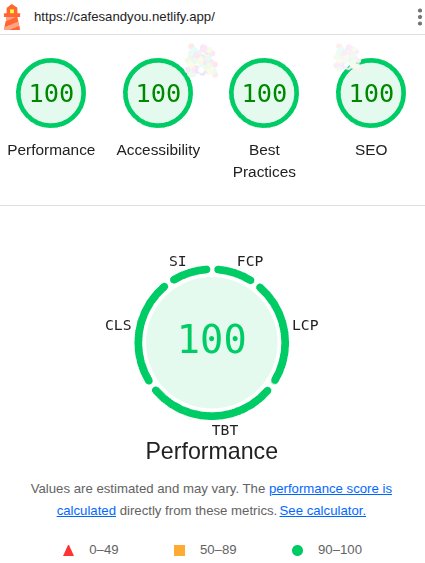
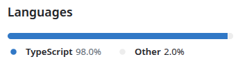

## Cafes & You App
This is a **placeholder with info for my cafe app private project** since the repo is private. The **code itself can be shown upon request during an interview process**.
### Optimizations Score

### 💬 Description
 🛠 Fullstack app with over 10.000 lines of code. Built with **React**, **Typescript**, **Supabase**, **Material UI** and **Leaflet** created in 2024.
 Go on a solo ride or connect with a soulmate and build your own Cafes experience! 😃
### 📡 APIs Used
  - [nominatim API](https://nominatim.org/)
  - [nominatim openstreetmap](https://nominatim.openstreetmap.org/ui/search.html)
### ⚙️ Full Tech Stack
- 
* Main:
  * React
  * TypeScript
  * Supabase
  * PostgreSQL
  * Material UI
  * Tanstack React Query
  * React Router
  * Axios
  * Cypress

### 🎨 Features
  - Authentication:
    - Login
    - Register
    - Logout
    - Password Reset
  - In-app features:
    - Create a list of the cafes you go, add ratings and other info:
      - Connect with a soulmate or go solo (his/her data will be visible for you as well)
      - rate cafes and add to favorites
      - add ratings and prices for drinks
      - add ratings and prices for food
      - add notes
      - add traits (payment type, sunny hours, quietness, window seat, laptop friendly, has lunch, has music)
      - see info in a **map view**
      - more than 10 options to sort and filter data
      - Customise your experience
